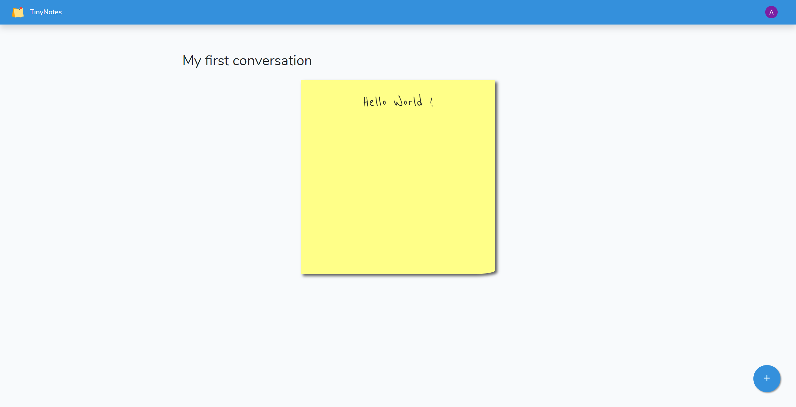

# TinyNotes

A small projet to discuss with your friends via post-it like messages.

Example:

Uses Laravel 5.8

## Installation

(requires composer and npm)  

-   Create a .env file with your database configuration (see https://github.com/laravel/laravel/blob/master/.env.example) at the root of the project.
-   Install Php dependencies:
    `composer install`  
-   Install Javascript dependencies :
    `npm install`
-   Update your database tables :
    `php artisan migrate`
-   Run your local server :
    `php artisan serve`
